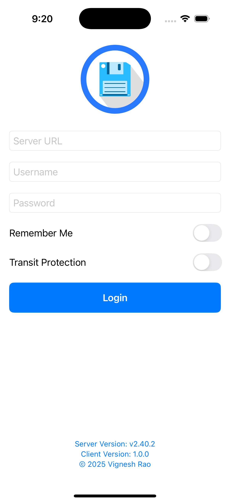

# FileBrowserClient
iOS app for Filebrowser

## Description

FileBrowserClient is an iOS application that allows users to connect to a Filebrowser server and manage files and directories.
It provides a user-friendly interface for browsing, downloading, renaming, and deleting files.

## Project Information

- **Project Name**: FileBrowserClient
- **Xcode**: 16.4
- **Build version**: 16F6
- **Apple Swift version**: 6.1.2 (swiftlang-6.1.2.1.2 clang-1700.0.13.5)
- **swift-driver version**: 1.120.5

<strong>Login Screen</strong>

    

## License & copyright

&copy; Vignesh Rao

Licensed under the [MIT License][license]

[license]: https://github.com/thevickypedia/Filebrowser-iOS/blob/main/LICENSE
